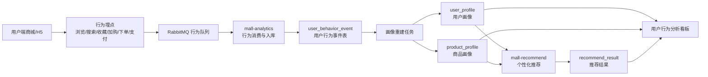

# 电商用户行为分析与商品推荐平台课程作业交付说明

## 1. 系统定位

本项目在 mall-swarm 电商系统基础上进行二次开发，目标是实现“基于电商用户行为数据的商品推荐与用户行为分析系统”。系统通过采集用户浏览、搜索、收藏、加购、下单、支付等行为，生成用户画像、商品画像和推荐结果，并在可视化看板中展示全体用户画像、单用户画像、商品分析和推荐结果。

## 2. 核心流程



## 3. 功能模块

| 模块 | 已实现功能 | 答辩说明重点 |
| --- | --- | --- |
| 行为采集 | 商品浏览、搜索、收藏、加购、下单、支付事件采集 | 行为数据不是手工填报，而是从业务操作中产生 |
| 行为存储 | `user_behavior_event` 统一记录行为类型、用户、商品、分类、时间、终端 | 后续统计和推荐都基于同一份行为事件数据 |
| 用户画像 | 浏览数、搜索数、收藏数、加购数、下单数、支付数、活跃天数、偏好分类 | 用行为强度和最近活跃时间描述用户价值 |
| 活跃度/RFM | R 最近活跃、F 行为频率、M 消费价值，综合分排序 | 左侧活跃用户 TOP 按 RFM 综合分降序展示 |
| 商品画像 | 商品浏览、收藏、加购、下单、支付、热度分、转化率 | 商品分析支持 ID、名称关键词、货号搜索 |
| 推荐结果 | 全站热门推荐、当前用户推荐、相似商品推荐 | 推荐结果带类型、分数、推荐原因和 TOP 排名 |
| 可视化看板 | 全体画像、单用户画像、商品分析、推荐结果、重建画像按钮 | 适合课堂演示和答辩讲解 |

## 4. 推荐逻辑说明

### 4.1 热门推荐

热门推荐面向全体用户，不区分个人偏好。商品热度由多种行为加权得到，例如浏览和搜索代表曝光兴趣，收藏和加购代表中等意向，下单和支付代表强购买意向。权重越高的行为对热度贡献越大。

### 4.2 个性化推荐

个性化推荐面向当前用户。系统先根据用户历史行为计算偏好分类和行为强度，再优先推荐用户偏好分类下热度高、转化表现较好的商品。推荐结果中会展示“基于偏好分类的热门商品”等原因。

### 4.3 相似商品推荐

相似推荐面向当前商品。用户在商品分析页选择商品后，系统根据商品分类和商品画像，推荐同分类下热度或行为表现相近的商品，用于解释“看了这个商品还可以推荐什么”。

## 5. 活跃度计算口径

RFM 模型用于左侧活跃用户 TOP 排名：

| 指标 | 含义 | 评分方式 |
| --- | --- | --- |
| R Recency | 最近活跃时间 | 7天内 100 分，30天内 70 分，90天内 40 分，更早 10 分 |
| F Frequency | 行为频率 | 浏览/搜索=1，收藏=2，加购=3，下单=4，支付=5，活跃天数额外加权，最高 100 分 |
| M Monetary | 消费价值 | 支付金额 >=5000 得 100 分，>=1000 得 70 分，大于 0 得 40 分，否则 0 分 |

综合分：

```text
RFM = R * 40% + F * 40% + M * 20%
```

用户分层：

| 综合分 | 用户类型 |
| --- | --- |
| >= 80 | 高价值活跃用户 |
| >= 60 | 活跃用户 |
| >= 40 | 一般活跃用户 |
| < 40 | 低活跃用户 |

## 6. 五人小组分工建议

| 成员 | 负责方向 | 可展示成果 |
| --- | --- | --- |
| 成员 A | 行为采集与埋点 | 说明浏览、搜索、收藏、加购、下单、支付如何进入行为事件表 |
| 成员 B | 用户画像与 RFM 活跃度 | 说明用户画像字段、RFM 公式、活跃用户 TOP 排名 |
| 成员 C | 商品画像与商品分析 | 说明商品热度、转化率、商品关键词搜索、无商品处理 |
| 成员 D | 推荐算法与推荐结果 | 说明热门推荐、个性化推荐、相似推荐、推荐原因 |
| 成员 E | 前端看板、部署与测试 | 展示看板四个页面、云服务器部署、接口测试和演示流程 |

## 7. 演示脚本

1. 打开用户端商城，模拟浏览商品、搜索关键词、收藏、加购、下单或支付。
2. 打开行为分析看板，点击“重建画像”按钮。
3. 在“全体用户画像”页面展示核心指标、用户等级分布、偏好分类分布。
4. 在左侧“活跃用户 TOP”中选择一个用户，进入单用户画像。
5. 讲解该用户 RFM 分数、偏好分类、行为汇总和个性化推荐。
6. 进入“商品分析”，输入商品 ID 或关键词搜索商品。
7. 点击商品卡片，展示单商品分析、行为汇总和相似商品推荐。
8. 进入“推荐结果”，展示全站热门推荐和当前用户推荐，说明推荐类型、推荐分和推荐原因。

## 8. 演示数据准备

如果当前系统行为数据较少，可执行：

```sql
SOURCE /opt/mall-swarm/document/sql/demo_behavior_seed.sql;
```

执行后点击看板中的“重建画像”按钮，使画像和推荐结果基于新行为数据重新生成。

## 9. 答辩常见问题

**为什么用户画像不是手动输入用户 ID？**
全体用户画像基于所有行为数据自动统计；单用户画像通过左侧活跃用户列表选择，列表按 RFM 活跃度降序排列。

**为什么商品分析支持关键词，但分析仍使用商品 ID？**
商品名称可能重复或包含特殊字符，关键词搜索用于找到候选商品；真正分析时使用商品 ID 作为唯一标识，保证统计结果准确。

**推荐结果是否可解释？**
可以。每条推荐包含推荐类型、推荐分和推荐原因，能说明该商品来自热门、个性化规则或相似商品逻辑。

**这个系统和普通后台统计有什么区别？**
普通统计只看订单或商品数据，本系统把用户行为事件作为基础数据，进一步生成用户画像、商品画像和推荐结果，更符合“用户行为分析与商品推荐”的题目要求。
